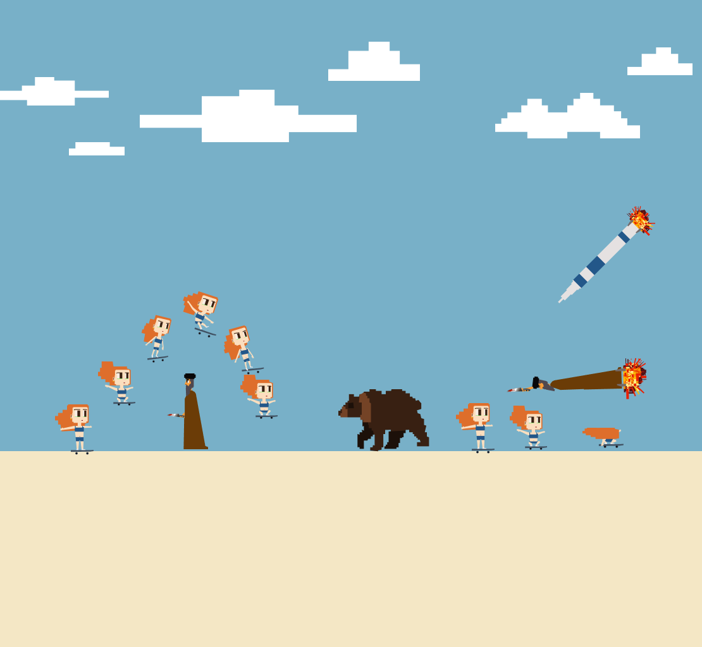
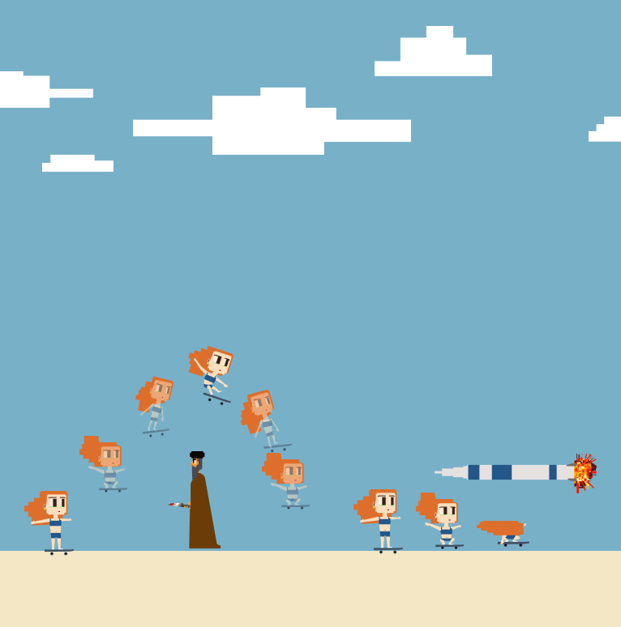
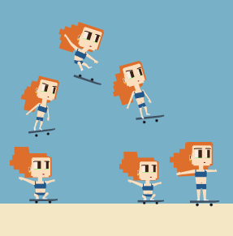
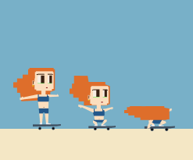
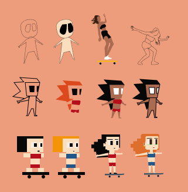

# Keep Moving in Iran

A browser-based survival game set in Iran during wartime, where a skateboarder must keep moving through a constantly changing field of missiles, Mullahs, and riot-control vehicles.

## About

I made *Keep Moving in Iran* during the 40-day US–Iran war.

The game takes the familiar structure of an endless survival game — similar to the Google Dinosaur game — and places it in a distinctly Iranian wartime environment.

The player controls a girl riding a skateboard. There is no destination and no way to stop. The only objective is to keep moving while recognizing and reacting to whatever appears in front of her.

The obstacles are deliberately drawn from the reality surrounding the game: missiles, Mullahs, and riot-control vehicles. Some must be jumped over, some require the player to duck, and one must actually be ridden.

What began as a small front-end game experiment became a way of turning a particular moment and its atmosphere into a simple interactive system: keep moving, react quickly, and find a way through.

## Gameplay

The game is built around a simple survival mechanic: the player continuously moves forward while obstacles approach from the opposite direction. Different obstacles require different reactions:

| Obstacle | Required Action |
|---|---|
| Rocket | Ride it to continue moving forward |
| Low-flying rocket | Sit down and lower your head |
| Mullah | Jump over it |
| Riot-control vehicle | Jump over it |
| Mullah-Rocket | Sit down and lower your head |

The challenge comes from recognizing each obstacle and responding with the correct movement before it reaches the player.

## Controls

| Key | Action |
|---|---|
| `Space` / `↑` | Jump |
| `↓` | Duck |

## Gameplay Video

[▶ Watch the gameplay video](video/skater.mp4)

## Screenshots







<!-- If any of these filenames changed during reorganizing, just tell me
     and I'll update these lines — nothing else in the file depends on them. -->

## Live Demo

**[Play Keep Moving in Iran](https://imanbehpasand.github.io/keep-moving-in-iran/)**

<!-- This link will only work once GitHub Pages is enabled for this repo:
     Settings → Pages → Deploy from branch → main → / (root). -->

## Development

*Keep Moving in Iran* was built as a front-end game experiment using HTML, CSS, and JavaScript. The project was developed without a game engine, using standard web technologies to handle the game environment, player movement, obstacle behavior, animation, and interaction.

The visual assets were created as SVG and PNG files and integrated directly into the game.

## Technical Challenges

**Player Movement**
The player needs to remain responsive while the game continuously moves forward. Different keyboard actions produce different responses depending on the obstacle approaching the player.

**Obstacle Interaction**
Each obstacle has its own required response. The game therefore combines different types of interaction rather than using a single jump-or-die mechanic.

**Collision Detection**
The game continuously checks the relationship between the player and incoming obstacles to determine whether the player successfully avoids them or collides with them.

**Animation**
Character and environmental movement are synchronized to create the feeling of a continuously moving game world.

## What I Learned

This project became a way to think about combining skills that are rarely found together in one person — in my case, animation and front-end development.

That combination is a real advantage, but it isn't only that. Pursuing multiple disciplines at once means having less time to bring any single one to a fully professional level, and it creates its own challenges in how you present yourself and your work.

*I'm currently writing a longer piece on this — "Amateur vs. Professional" — covering both sides of working across disciplines. Link coming soon.*

## Technologies

- HTML5
- CSS3
- JavaScript
- SVG
- PNG

## Features

- Endless survival gameplay
- Skateboarder character
- Keyboard-controlled movement
- Jump and duck mechanics
- Multiple obstacle types
- Obstacle-specific interactions
- Collision detection
- Character animation
- SVG-based visual assets
- Browser-based gameplay

## Running the Game Locally

1. **Clone the repository**
   ```bash
   git clone https://github.com/imanbehpasand/keep-moving-in-iran.git
   ```

2. **Move into the project folder**
   ```bash
   cd keep-moving-in-iran
   ```

3. **Open `index.html` in your browser**
   No build step or dependencies required — this is a pure HTML/CSS/JavaScript project. Double-clicking `index.html` works, but if you run into asset-loading issues, serving the folder with a simple local server (e.g. the VS Code "Live Server" extension) avoids browser file-access restrictions.

## License

<!-- Add a license if you want others to know what they can/can't do
     with this code — MIT is a common permissive default for personal
     projects if you're unsure which to pick. -->
